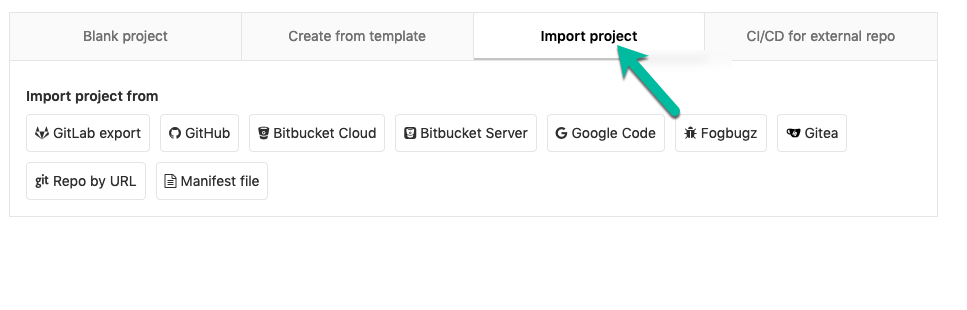
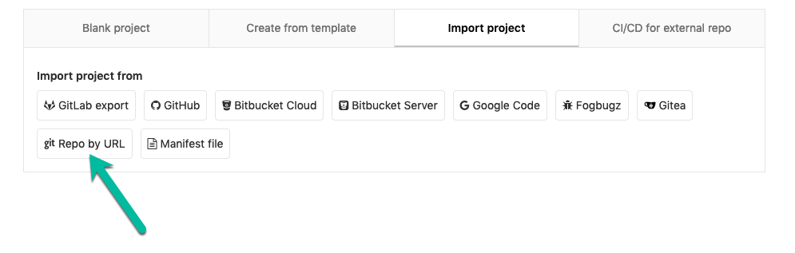
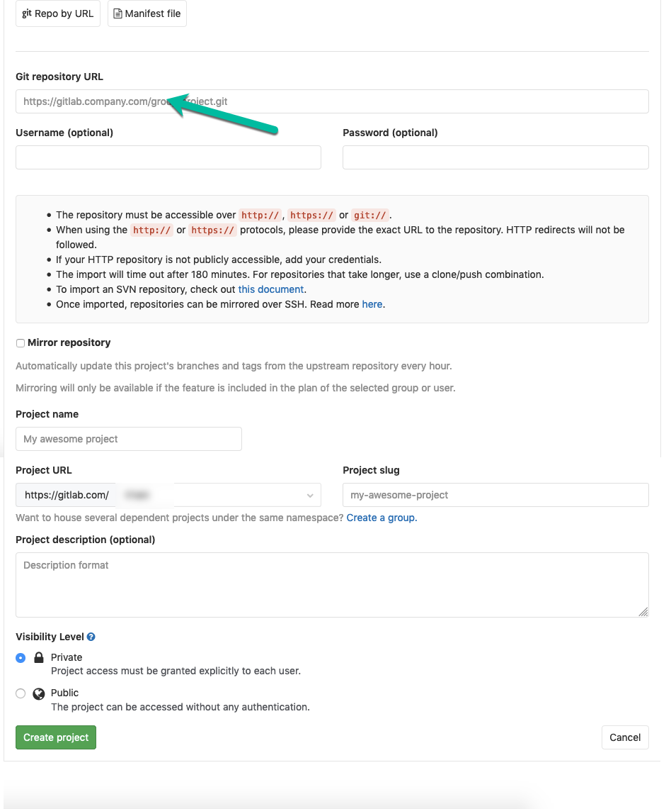
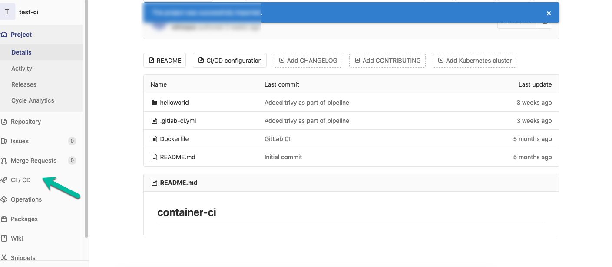
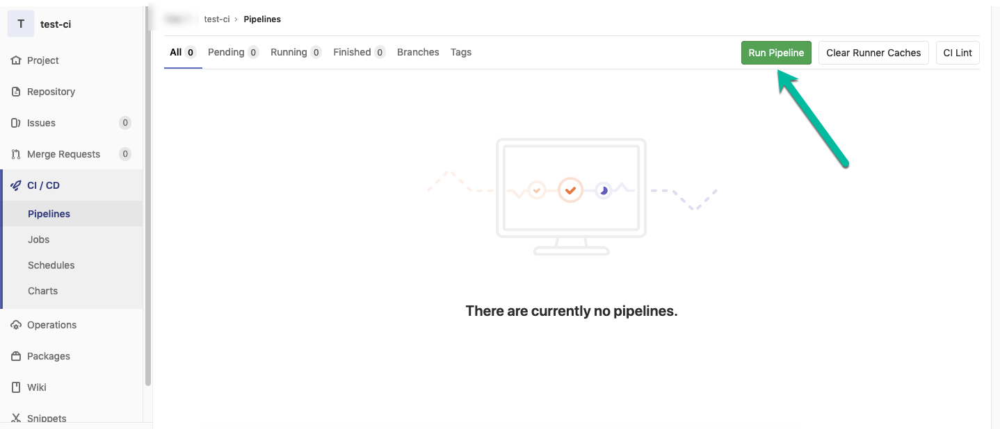
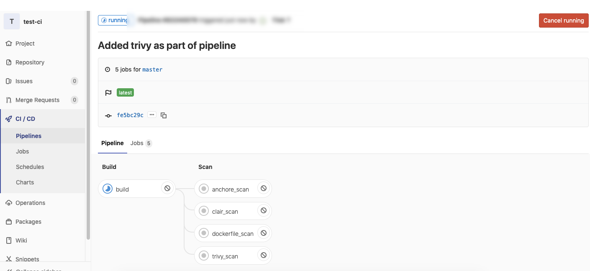

# CI for Container Security


* Step 1: Register/Login to [gitlab](https://gitlab.com/users/sign_in)

* Step 2: [Create a gitlab project](https://gitlab.com/projects/new)

  * Click to `import project` icon
  
   
   
  * Click to `Repo by URL`
  
  
  
  * Fill `https://github.com/we45/container-ci.git` as the `Git repository URL`, specify a project name and click `create the project` button
   
   ```commandline
    https://github.com/we45/container-ci.git
    ```
   
   
   
* Step 3: Once the repository has been imported, all files should be visible in the project.

* Step 4: `.gitlab-ci.yml` is the file that is configured to build the docker image and run specified scans.

* Step 5: Select `CI/CD`. Create and Run the pipeline



* Step 6: Click `Run Pipeline` button.

>> Note: if it is a first time you may have to click twice `Run Pipeline` button.




* Step 7: Wait for the pipeline to execute and observe the results




---------

### Reading Material/References:
