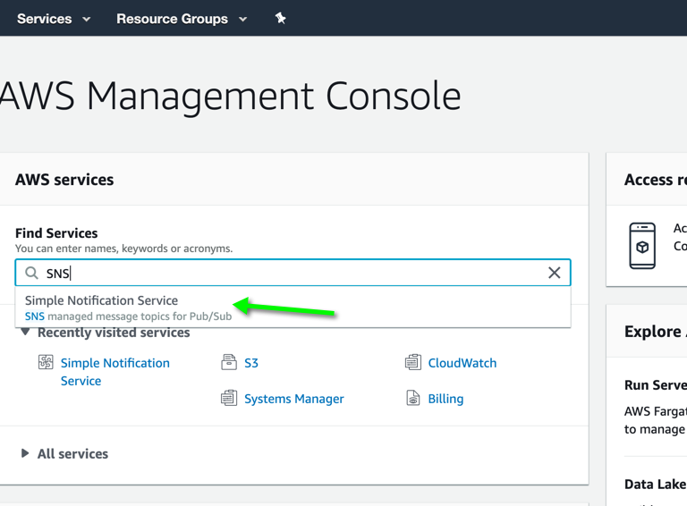
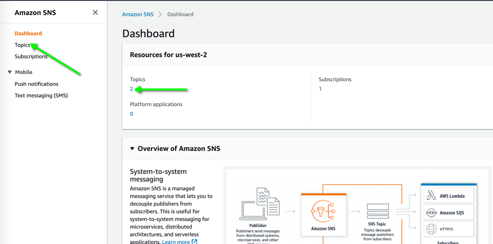
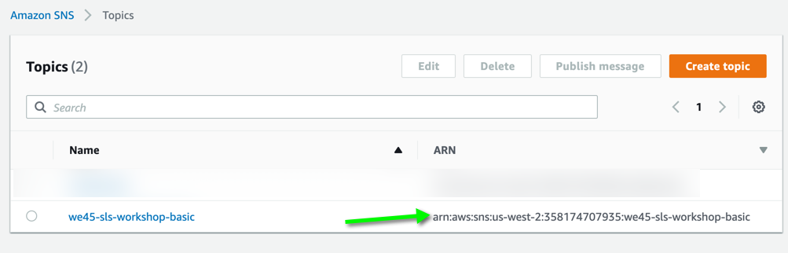

# **Basic Serverless Events**

---

> #### This is a basic lesson in triggering serverless functions for Non-API Gateway Events. 
> #### We will trigger a Serverless Function whenever messages are published over a particular SNS (Simple Notification Service) Topic (Channel)

### **Lab Image : `Serverless`**

---

> **Note:** If you have not setup your aws cli follow [AWS-CLI-Configuration](aws-configure/README.md) under the `Setup` section*

#### Step 1:

* Navigate to the `Basic-Event` directory on the provisioned server.

```commandline
cd /root/labs/Serverless-Workshop/Basic-Event
```

* Install the necessary requirements

```commandline
sls plugin install -n serverless-python-requirements
```

---

#### Step 2:

* Take a look at the contents of the `serverless.yml` [here](https://github.com/we45/Serverless-Workshop/blob/master/Basic-Event/serverless.yml)

```commandline
cat serverless.yml
```

---

#### Step 3:

* Deploy the function and wait for the deployment to complete.

```commandline
sls deploy
```

* Once the deployment is complete, an API endpoint(s) is displayed.

---

#### Step 4:

* On the browser, access your AWS console and look for Simple Notification Service or `SNS`



* Click to go to SNS Main Page, which looks like this and click on topics to find the ARNS of all your current topics



* Now Copy the Topic-ARN



---

#### Step 5:

* Publish a message to SNS using `aws-cli`

```bash
aws sns publish --region 'us-west-2' --topic-arn "<Copied ARN>" --message "I am going to be pwning Serverless Functions soon!"
```

> #### **Remember to substitute the `<Copied ARN>` with the ARN that you copied from the previous step and also replace the region**

---

#### Step 6:

* Let's see whether the Serverless Function worked, by running the following command

```commandline
sls logs --function sns-reactor
```

> **EXAMPLE**:

```commandline
START RequestId: 44478848-a777-45e0-a1cf-e11cd499071e Version: $LATEST
END RequestId: 44478848-a777-45e0-a1cf-e11cd499071e
REPORT RequestId: 44478848-a777-45e0-a1cf-e11cd499071e	Duration: 1.41 ms	Billed Duration: 100 ms 	Memory Size: 512 MB	Max Memory Used: 52 MB

START RequestId: 1066617f-4b0f-4683-b91b-ffbd81e40a86 Version: $LATEST
{'Records': TRUNCATED
```

---

#### *Teardown*:

* On the provisioned server, navigate to `Basic-Event` directory.

```commandline
cd /root/labs/Serverless-Workshop/Basic-Event
```

* Remove the serverless function that was deployed

```commandline
sls remove --force
```
